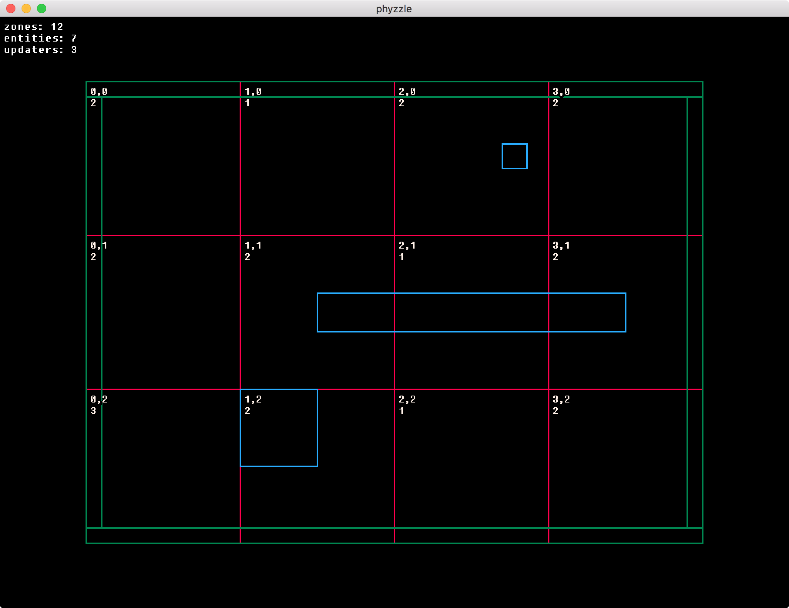

# Phyzzle

**Version 0.2**

Simple 2D AABB arcade physics system for Lua and LÖVE.

Great for classic platformers, shooters, prototyping, jams and learning.

- Simple and easy to understand code
- Documented
- Efficient
- Separate Renderer
- Core Map can be used with any Lua engine
- MIT License
- Simple :)

## Example LÖVE App

Use WASD to move.



## Upcoming Features

- Stickies: attach entities to others to move with them.
  Great for complex entities, lifts and platforms.
- Example PICO-8 Renderer

## Usage

```lua
-- main.lua

local Map = require('map')
local Entity = require('entity')

local map

function love.load(arg)
  -- you can override the default zone size
  -- see map.lua for more information
  map = Map:new{ w = 800, h = 600, zs = 200 }

  -- updating (non static) entity
  map:add(Entity:new{ x = 200, y = 400, w = 100, h = 100 })

  -- static (non updating) entity
  map:add(Entity:new{ x = 0, y = 0, w = 800, h = 20, static = true })

  -- static non collider
  -- updates but doesn't collide (good for doodads)
  map:add(Entity:new{ x = 250, y = 100, w = 50, h = 50, static = true, collider = false })

  -- get entities in a region
  local gets = map:get{ x = 40, y = 40, w = 600, h = 500 }

  for k,v in pairs(gets) do
    print(v.x, v.y, v.w, v.h)
  end
end

function love.update(dt)
  -- detect keypresses for entity movement in the entity update
  -- see player.lua for an example
  map:update(dt)
end

-- example custom renderer
function love.draw()
  -- if needed you can get zone coordinates in a region
  -- local x1, y1, x2, y2 = map:region{ x = 40, y = 40, w = 600, h = 500 }

  for x = 0, self.map.zw - 1 do
    for y = 0, self.map.zh - 1 do

      for k, e in pairs(self.map.zones[x][y]) do
        -- draw entity any way you want
        love.graphics.rectangle('line', e.x, e.y, e.w, e.h)
      end
    end
  end
end

-- entity.lua
-- entity collision and move resolution functions

function Player:update(dt)
  -- check for keypresses or update via AI
  -- example usage of moving entity in the map and checking for collisions
  self.map:move(self, self.x + (400 * dt), self.y + (400 * dt))
end

-- acceleration variables xa, ya are zeroed on collision
-- but you don't have to use them if you don't want
function Entity:collision(e2, nx, ny, direction)
  if direction == self.map.UP then
    self.y = e2.y + e2.h
    self.ya = 0
  elseif direction == self.map.DOWN then
    self.y = e2.y - self.h
    self.ya = 0
  elseif direction == self.map.LEFT then
    self.x = e2.x + e2.w
    self.xa = 0
  elseif direction == self.map.RIGHT then
    self.x = e2.x - self.w
    self.xa = 0
  end
end

-- no collision so update the position to the new location
function Entity:move(nx, ny)
  self.x = nx
  self.y = ny
end

```

## License

MIT License

Copyright (c) 2016 gamedevaton

Permission is hereby granted, free of charge, to any person obtaining a copy
of this software and associated documentation files (the "Software"), to deal
in the Software without restriction, including without limitation the rights
to use, copy, modify, merge, publish, distribute, sublicense, and/or sell
copies of the Software, and to permit persons to whom the Software is
furnished to do so, subject to the following conditions:

The above copyright notice and this permission notice shall be included in all
copies or substantial portions of the Software.

THE SOFTWARE IS PROVIDED "AS IS", WITHOUT WARRANTY OF ANY KIND, EXPRESS OR
IMPLIED, INCLUDING BUT NOT LIMITED TO THE WARRANTIES OF MERCHANTABILITY,
FITNESS FOR A PARTICULAR PURPOSE AND NONINFRINGEMENT. IN NO EVENT SHALL THE
AUTHORS OR COPYRIGHT HOLDERS BE LIABLE FOR ANY CLAIM, DAMAGES OR OTHER
LIABILITY, WHETHER IN AN ACTION OF CONTRACT, TORT OR OTHERWISE, ARISING FROM,
OUT OF OR IN CONNECTION WITH THE SOFTWARE OR THE USE OR OTHER DEALINGS IN THE
SOFTWARE.
