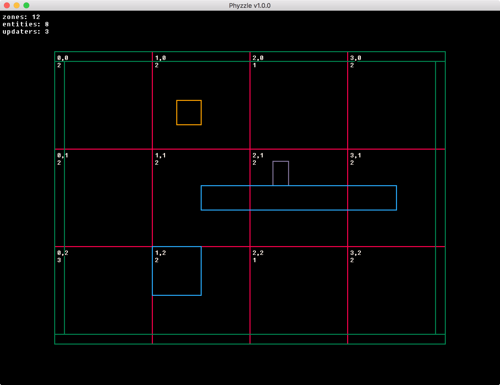

# Phyzzle v2.0.0

Simple 2D AABB arcade physics system for Lua and LÖVE.

Great for classic platformers, shooters, prototyping, jams and learning.

- Simple and easy to understand code
- Documented
- Efficient
- Separate Renderer
- Core Map can be used with any Lua engine
- MIT License
- Simple :)

## Usage

Add `map.lua` and `entity.lua` to your project.

Take a look at the example LÖVE app for example usage, `A` and `D` move `W` jump.

## Upcoming Features

- Stickies: attach entities to others to move with them.
  Great for complex entities, lifts and platforms.
- Circle collision detection (no resolution planned).
  Useful for triggers.
- Example PICO-8 Renderer

## Changelog

### v2.0.0 (in development)

- Added changelog
- Map:move takes change to position instead of new position
- Improved example app with platforms
- Improved documentation with Lua doc

### v1.0.0

- First release

## License

MIT License

Copyright (c) 2016 gamedevaton

Permission is hereby granted, free of charge, to any person obtaining a copy
of this software and associated documentation files (the "Software"), to deal
in the Software without restriction, including without limitation the rights
to use, copy, modify, merge, publish, distribute, sublicense, and/or sell
copies of the Software, and to permit persons to whom the Software is
furnished to do so, subject to the following conditions:

The above copyright notice and this permission notice shall be included in all
copies or substantial portions of the Software.

THE SOFTWARE IS PROVIDED "AS IS", WITHOUT WARRANTY OF ANY KIND, EXPRESS OR
IMPLIED, INCLUDING BUT NOT LIMITED TO THE WARRANTIES OF MERCHANTABILITY,
FITNESS FOR A PARTICULAR PURPOSE AND NONINFRINGEMENT. IN NO EVENT SHALL THE
AUTHORS OR COPYRIGHT HOLDERS BE LIABLE FOR ANY CLAIM, DAMAGES OR OTHER
LIABILITY, WHETHER IN AN ACTION OF CONTRACT, TORT OR OTHERWISE, ARISING FROM,
OUT OF OR IN CONNECTION WITH THE SOFTWARE OR THE USE OR OTHER DEALINGS IN THE
SOFTWARE.
